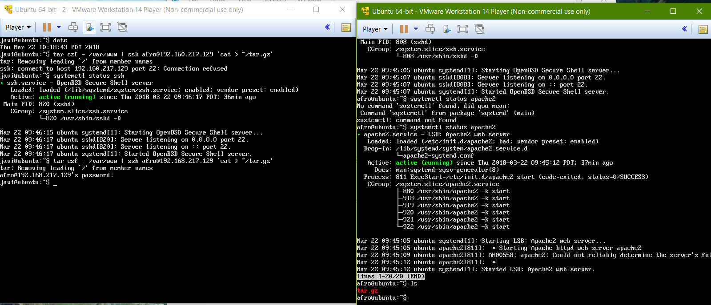
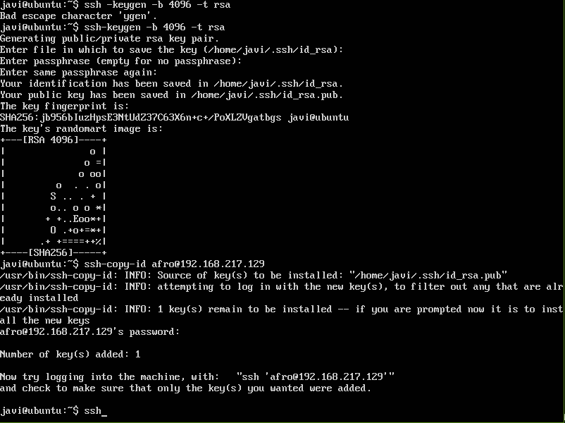
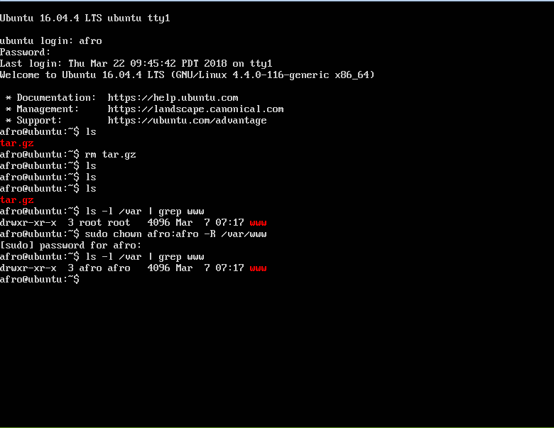
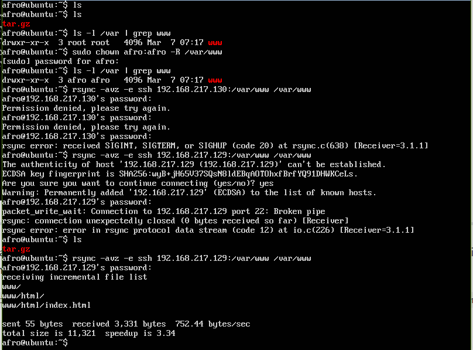
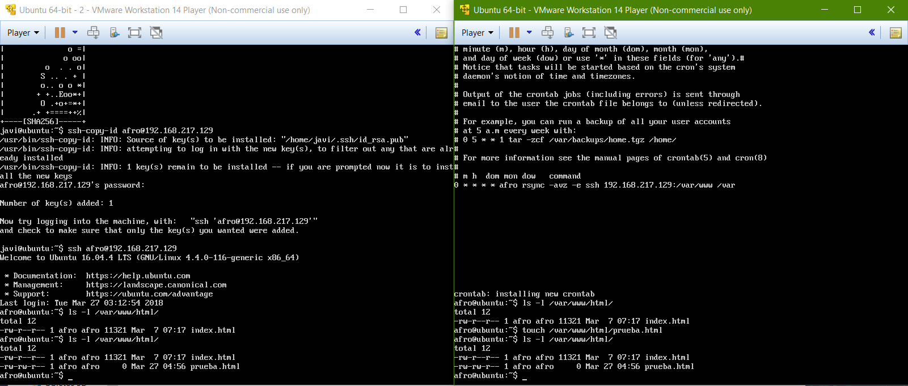

# Práctica 2

Para la realización de esta práctica debemos de tener realizada la primera parte en la cual creamos las máquinas virtuales y las conectamos mediante ssh. En esta práctica nuestro objetivo va a ser clonar la información de un sitio web. Para si realización seguiremos los siguientes pasos.

1. Primero vamos a realizar la copia de los distintos archivos de una máquina a otra mediante un comprimido. Esto lo realizaremos mediente la orden **tar** haciendo un pipe con **ssh** a la máquina servidor.

2. Ahora vamos a acceder mediante **ssh** a otra máquina sin contraseña, para ello vamos a usar la operación **keygen** de la orden **ssh**. Una vez ejecutada la orden debemos de dejar todos los campos en blando y finalmente tendremos el código generado.

3. Lo que debemos hacer a continueción es configurar los permisos en **/var/www**  para que nuestro usuario tenga los permisos necesarios.

Una vez hecho esto procedemos a realizar el clonado mediante **rsync**

4. Finalmente vamos a programar esta accion mediante un crontab para que se ejecute de manera continuada y mantener los sistemas actualizados.

