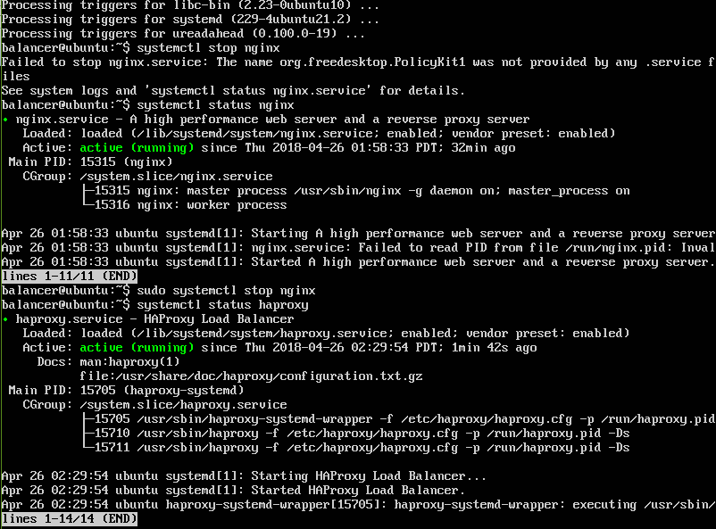
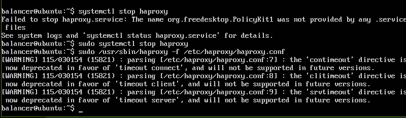
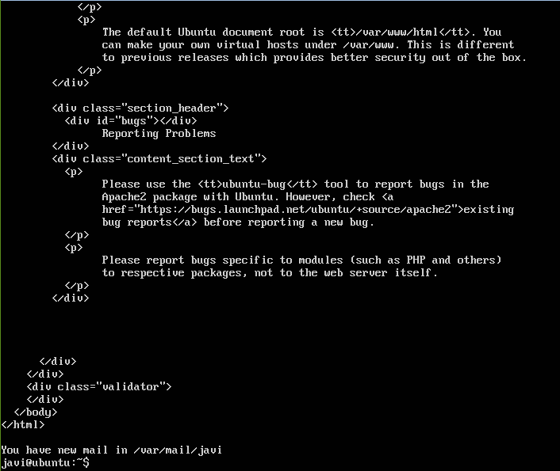
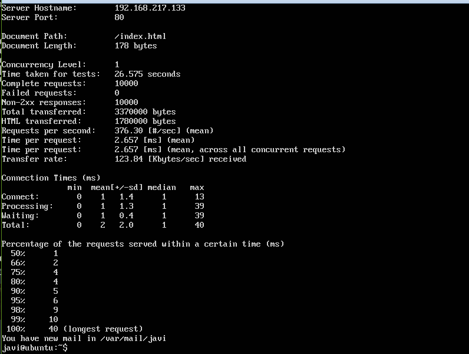
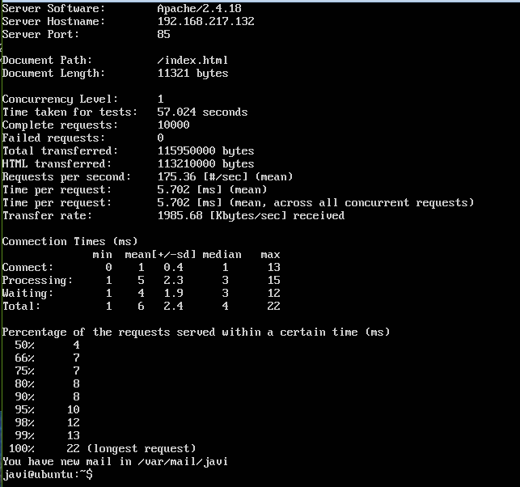

# Práctica 3

Para la realización de esta práctica vamos a necesitar una tercera máquina similar a las 2 anterioes en la cual procederemos a instalar **Nginx**. Para ell simplemente ejecutamos el comando **sudo apt-get install nginx** y despues de la instalación comprabamos el estado del servicio con **systemctl status nginx**

Una ve tenemos nginx instalado debemos de editar el archivo de **/etc/nginx/conf.d/defeult.conf** como se muestra a continuación para que **Nginx** funcione como un balanceador de carga.

Las 2 direcciones IP que aparecen arriba son las direccione de las 2 máquinas anteriores. Una vez tenemos esto configurado y guardado en el sistema vamos a probar la conexión desde la máquina cliente haceiendo `curl http://<ip_de_la_máquina>`

Como se puede ver nos muestra el html por defecto que trae **Nginx**. Despues de haber realizado estas comprobaciones procedemos a realizar los mismos pasos con **HaProxy** el cual tambien instalaremos con el comando **sudo apt-get install haproxy**. Una vez lo tengamos instalado debemos de parar primeor el servicio de **Nginx** para poder ejecutar el de **HaProxy** tal como se muestra a continuación:

Ahora debemos primero parar el servicio de **HaProxy** para poder ejecutar la siguiente orden: **sudo /usr/sbin/haproxy -f /etc/haproxy/haproxy.conf**

Luego debemos editar el archivo **/etc/haproxy/haproxy.conf** y reemplazar su contenido por el siguiente:

Una vez que tenemos esto realizamos de nuevo desde la máquina cliente una conexión **http** para comprobar la disponibilidad:

Ahora que tenemos los dos servicios vamos a proceder a realizar una ejecución de apache benchmark a cada uno de ellos, para ello deberemos escribir la siguiente línera en la máquina cliente:`ab -n 1000 -c 10 http://<ip de la máquina>:<port(80/85)/index.html`

una vez realizada la ejecución aqui podemos ver los resultados para **Nginx**:

Y los resultado para **HaProxy**

En los dos balanceadores no ha habido ninguna pérdida de paquetes, lo que se puede apreciar es que **HaProxy** ha recibido mas paquetes por segundo que **Ngix** así que en el caso de decantarse por un balanceador podríamos decidirnos por **HaProxy**