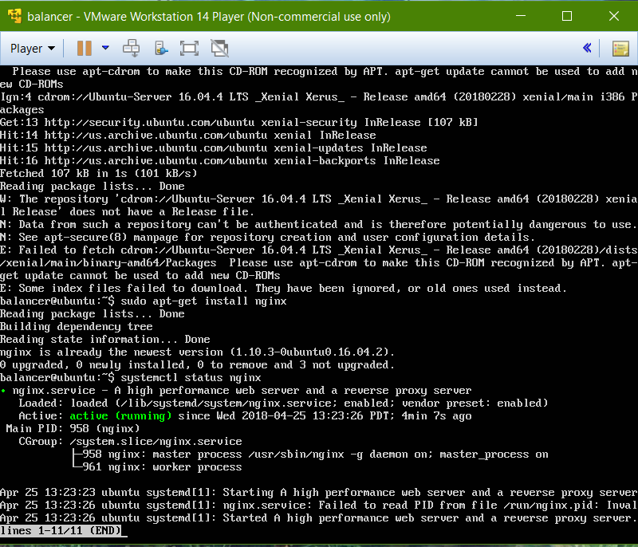

# Práctica 3

Para la realización de esta práctica vamos a necesitar una tercera máquina similar a las 2 anterioes en la cual procederemos a instalar **Nginx**. Para ell simplemente ejecutamos el comando **sudo apt-get install nginx** y despues de la instalación comprabamos el estado del servicio con **systemctl status nginx**

