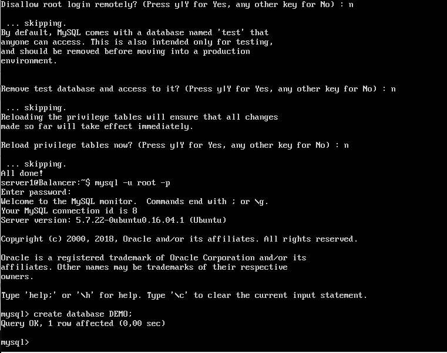
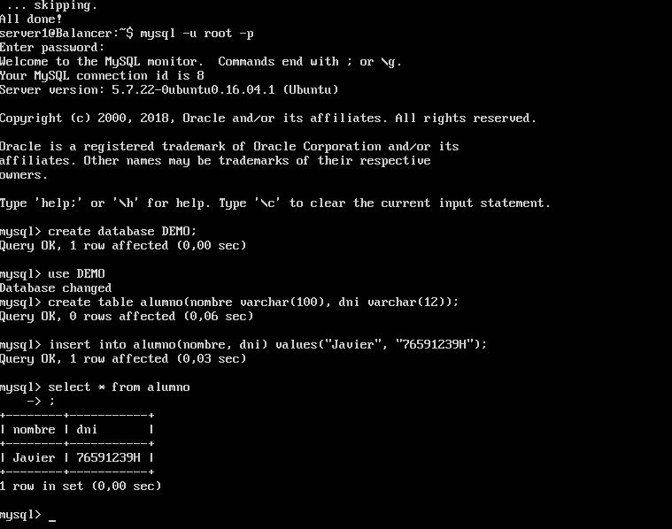
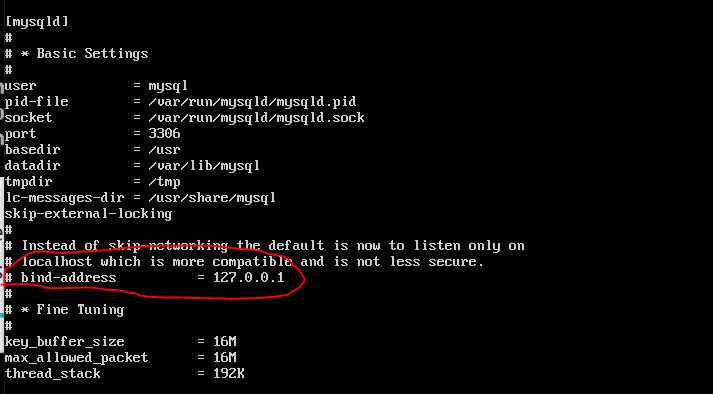
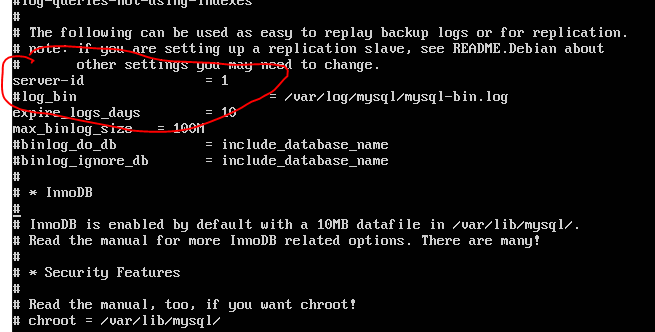
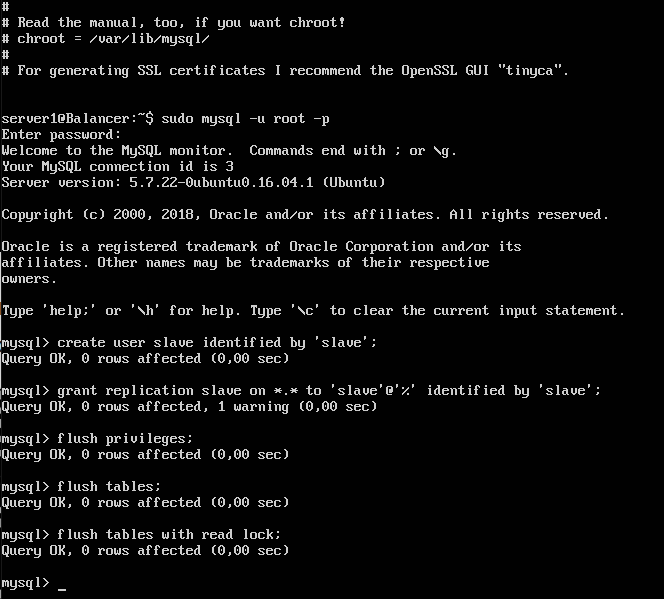
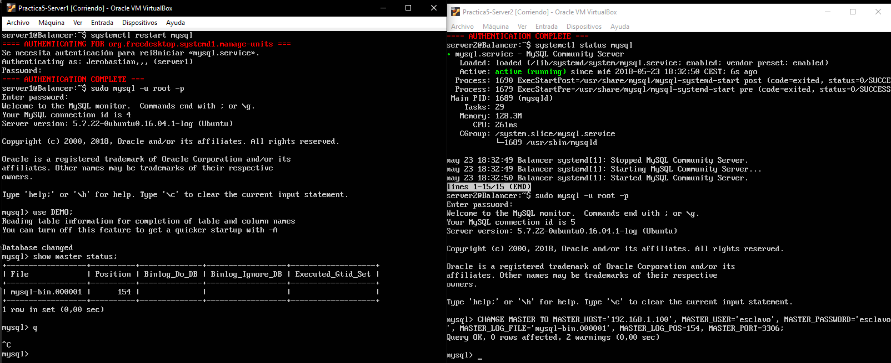
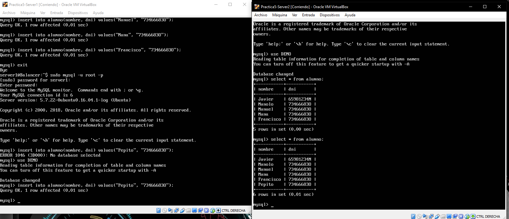

# Práctica 5

Para la realización de esta práctica vamos a utilizar dos nuevas máquinas servidoras en las cuales alojaremos una base de datos la cual se replicara para generar una copia de seguridad.

1. Primero debemos crear una base de datos, para ello usamos el comando **mysql -u root -p**

Una vez tenemos la consola de mysql creamos la base de datos en nuestro caso se llamara DEMO. Despues creamos una tabla alumno.

2. Una vez que tenemos esta base de datos la exportamos con el comando **mysqldymp** lo que nos generara el archivo demo.sql.

Una vez generado el archovo nos lo descargamos en la segunda máquina con el comando scp:

1. Ahora debemos realizar una serie de cambios en el fichero de configuración de ambas máquinas **/etc/mysql/mysql.conf.d/mysqld.cnf** 

Esto lo realizamos en la máquina maestra en la máquina esclava hacemos lo mismo pero cambiando el server id por 2.
Despues de eso reiniciamos el servicio de mysql e introducimos los siguientes comandos en las máquinas maestro y esclavo:

Esto en la máquina maestro:

Y esto en la máquina esclavo:

Finalmente comprobamos que funciona al realizar cualquier cambio en la máuina maestro se actualizará en la esclavo.

