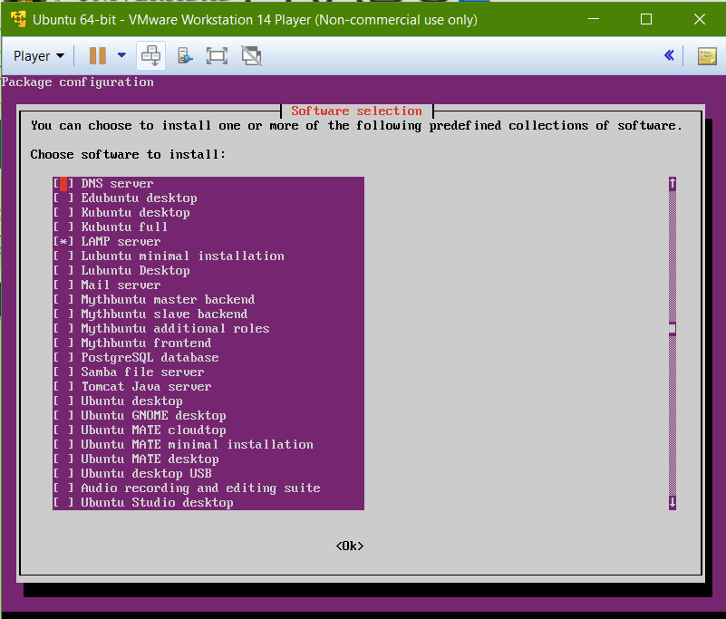
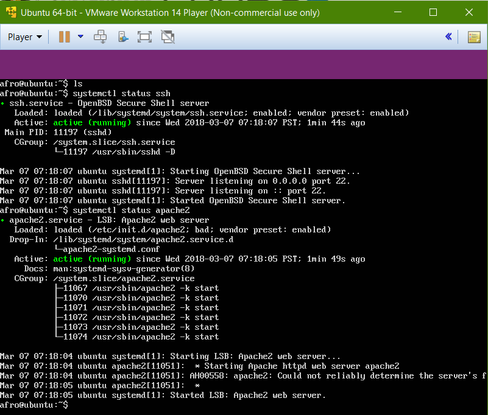
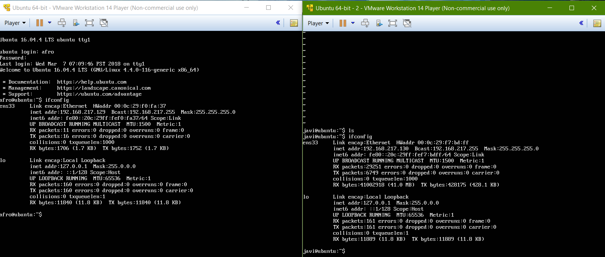
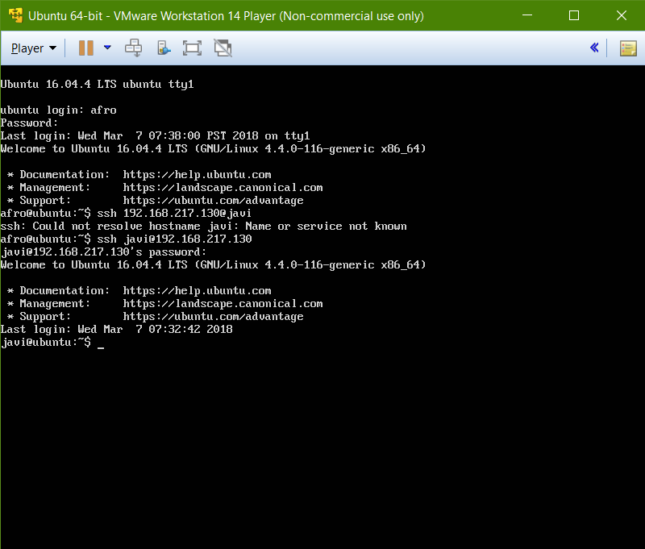
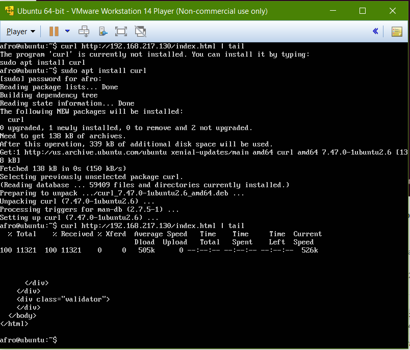

# PracticasSWAP
## Práctica 1

En esta práctica vamos a realizar la instalación de dos máquinas virtuales con Ubuntu server en ambas
y vamos a habilitar los servicios para permitir que las dos máquinas se conectar entre si.

1. Primero vamos a proceder a instalar las máquinas virtuales. Descargamos de la página web de ubuntu la Iso de Ubuntu server
y creamos una máquina vertual con esa ISO en VMWare, dandole 20 gigas de almacenamiento y 2 gigas de RAM.

Como hemos visto una vez instalado el sistema operativo procedemos a habilitar los servicios de ssh y apache2 activando la
opción de LAMP y OpenSSH. Cuando estos servicios se terminen de instalar comprobamos que se encuentran operativos.

Este proceso lo repetimos para la segunda máquina que instalemos la cual contará con las mismas características.

2. Una vez tenemos las dos máquinas funcionando, comprobamos sus direcciones IP para realizar las pruebas de conexión.

Como se puede ver la dirección de la primera máquina es **192.168.217.129**, y la dirección de la segunda es **192.168.217.130**

3. Ahora vamos a comprobar que ambas máquinas pueden conectarse entre si.

Aqui acabamos de realizar la prueba de conexión mediante ssh de la máquina 1 a la máquina 2.

Aqui realizamos la conexión de mediante curl de la máquina 1 a la máquina 2.

Fin
