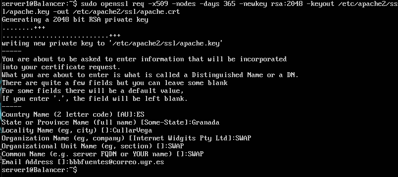
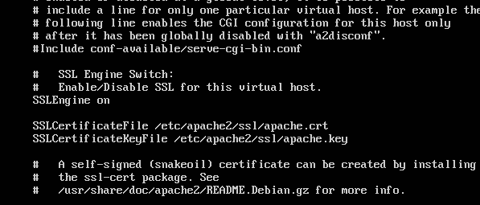
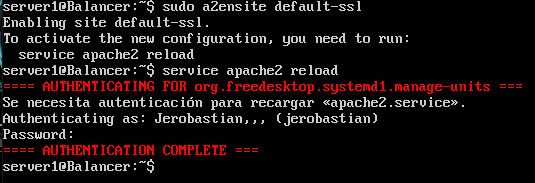
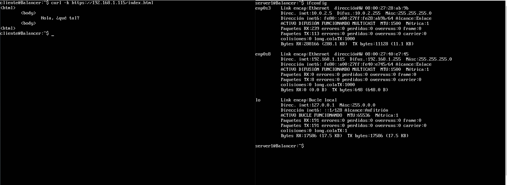
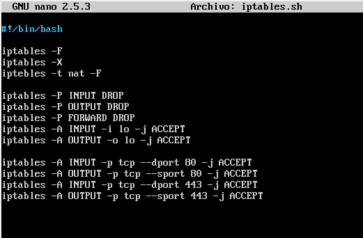
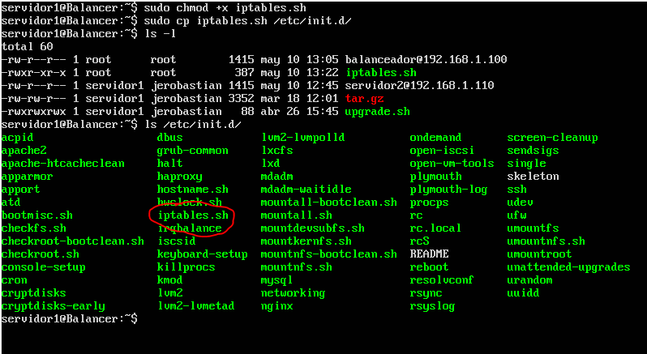
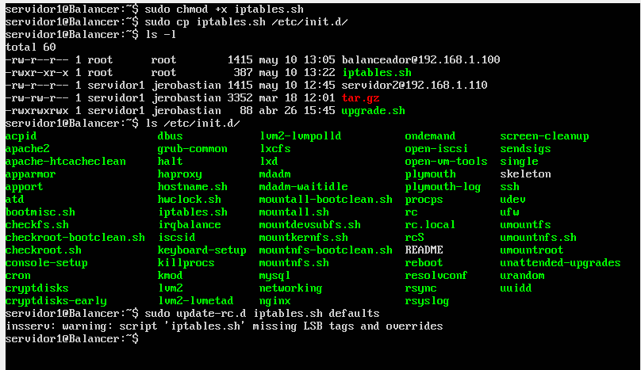

# Práctica 4

Para la realización de esta práctica vamos a utilizar una de las máquinas servidoras que ya teníamos montadas. La tarea que vamos a realizar es realizar una configuración de seguridad para asegurar la granja web.

1. Primero debemos instalar y configurar SSL. Este es un modulo de apache2 así que partiendo de que tenemos apache ya instalado en el sistema ejecutamos el comando:

**sudo a2enmod ssl**

Despues de realizar esta configuración debemos ejecutar la siguente operacion dentro de el directorio **/etc/apache2**

Una vez ejecutadas estas dos operaciones debemos de añadir las dos líneas siguentes al archivo **/etc/apache2/sites-available/default-ssl** justo despues de **SSLEngina on**

Ahora debemos activar el sitio por defecto con el comando **a2ensite default-ssl**

AHora vamos a comprobar el acceso mediante **curl** y **https** desde la máquina cliente a la máquina servidor

 Una vez tengamos esto debemos repetir la configuración con el rsto de máquinas servidras del sistema que tenemos

 2. Configurando el cortafuegos. Ahora vamos a proceder a escribir un script que se encargue de restringir el acceso, dejando solamente acceso a localhost y solo mediante los protocolos HTTP y HTTPS

Para ejecutar este script cada vez que se arranque el sistema debemos de hacer us del directorio **/etc/init.d/** que es donde se alojan los scripts que se ejecutan al comienzo del sistema.

Para que pueda arrancar como servicio hay que convertirlo en demonio:

