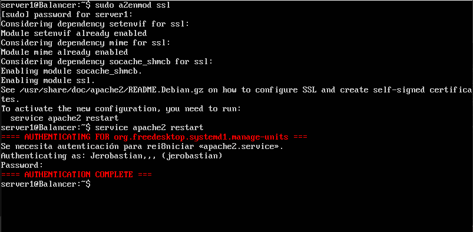

# Práctica 4

Para la realización de esta práctica vamos a utilizar una de las máquinas servidoras que ya teníamos montadas. La tarea que vamos a realizar es realizar una configuración de seguridad para asegurar la granja web.

1. Primero debemos instalar y configurar SSL. Este es un modulo de apache2 así que partiendo de que tenemos apache ya instalado en el sistema ejecutamos el comando:

**sudo a2enmod ssl**

Despues de realizar esta configuración debemos ejecutar la siguente operacion dentro de el directorio **/etc/apache2**

Una vez ejecutadas estas dos operaciones debemos de añadir las dos líneas siguentes al archivo **/etc/apache2/sites-available/default-ssl** justo despues de **SSLEngina on**

